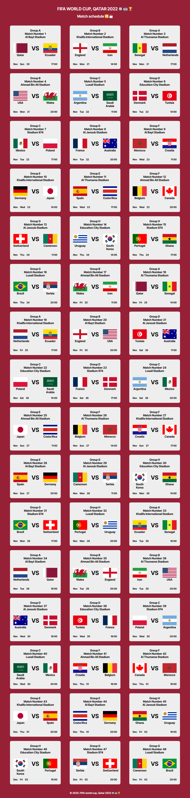

## COUPE DU MONDE DE LA FIFA, QATAR 2022 ⚽ 🏟 🏆 : CALENDRIER DES MATCHS

## Le challenge

Création du calendrier des matchs de la coupe du monde de la FIFA 2022 au Qatar.

Une fois sur la page web, l'ulisateur voit apparaître le calendrier des matchs ainsi que des informations notamment le groupe, la date et l'heure de la rencontre...

## Démonstration

Lien vers le projet : https://aperbet56.github.io/fifa_world_cup_2022/

## Projet développé avec

- Utilisation des balises sémantiques HTML5
- CSS3
- Flexbox
- Importation de la police Inter Tight
- Utilisation d'un normaliseur : le fichier normalize.css
- Animation CSS au survol des cartes
- Page web responsive
- fifa-world-cup.json (json = JavaScript object notation)
- JavaScript (fetch, fonctions fléchées, boucle for...)
- Code JavaScript commenté
- new IntersectionObserver
- Desktop first
